# 操作系统

## 1

### 什么是操作系统

#### 层次结构
硬件之上
应用程序之下
#### 内容
学习的是内核(kernel)，而不是外壳(Shell)如Linux,Windows,Android的界面
#### OS Kernel的特征
* 并发
    - 计算机系统中同时存在多个运行的程序，需要OS管理和调度
* 共享
    - “同时”访问
    - 互斥共享
* 虚拟
    - 利用多道程序设计技术，让每个用户都觉的有一个计算机专门为他服务
* 异步
    - 程序的执行不是一贯到底,而是走走停停，向前推进速度不可知
    - 但只要运行环境相同，OS需要保证程序运行结果相同

####操作系统实例
* UNIX家族
* Linux家族
* Windows

## 2
### 操作系统的启动

//TODO: (img/1)

DISK: 存放OS
BIOS：基本I/O处理系统
Bootloader: 加载OS

#### 加载OS
* BIOS
    * 开始加电BIOS从特定的地址开始执行完成工作：
        * POST(加电自检)
        * 寻找显卡和执行BIOS等
    * 将Bootloader从硬盘的引导扇区(512字节)加载到内存(如：0x7c00)

* Bootloader
    * 将操作系统的代码和数据从硬盘加载到内存中
    * 跳转到操作系统的起始地址

#### OS的interface(系统调用，异常，中断)
* 系统调用(来源于应用程序)
    - 应用程序主动向操作系统发出服务请求
* 异常(来源于不良应用程序)
    - 非法指令或者其他坏的处理状态(如：内存出错)
* 中断(来源于外设)
    - 来自不同的硬件设备的计时器和网络的中断

##### 应用程序不能直接访问外设
##### 如何设计和实现
##### 区别和特点
* 源头(同上)

* 处理时间
    * 中断：异步（事件产生时，应用程序并不知道它什么时候会产生，只有当他产生了才去处理）
    * 异常：同步（一定是执行到某一条特定指令时一定会产生）
    * 系统调用：异步或同步（产生系统调用来看是同步的：一定是执行到某一条特定指令时一定会产生；从系统调用的返回时间来说：如果应用程序发出系统调用请求后一直在等待则为同步、如果应用程序去做别的事了就是异步）

* 响应
    * 中断：持续，对用户应用程序是透明的
    * 异常：杀手或重新执行意想不到的应用程序指令
    * 系统调用：等待和持续

### 中断异常处理机制
通过一个表(类似与map),key是中断号，对应一个中断服务

保存与恢复机制(在紧急处理结束后，恢复正常程序)

#### 中断过程
* 硬件
    * 设置中断标记[CPU初始化]
        1. 将内部，外部事件设置中断标记
        2. 中断时间的ID
* 软件(OS)
    * 保存但前处理状态
    * 中断服务程序处理
    * 清除中断标记
    * 恢复之前保存的处理状态

#### 异常
* 保存现场
* 异常处理
    * 杀死产生异常的程序
    * 重新执行异常指令
* 恢复现场

### 系统调用
程序通过OS提供的interface来对硬件进行调用
程序访问主要是通过高层次的API接口而不是直接进行系统调用
如：

    * win32 API 用于Windows
    * POISIX API 用于 POSIX-based systems(包括UNIX，MacOS, Linux)

//TODO: img 2.2 12:00
程序通过Library库来访问系统调用，触发 用户态(程序特权集状态)-->内核态(操作系统的状态)
    * 用户态，权利有限，保证安全

#### 和函数调用的区别
1. 函数调用在一个栈空间完成

2. 系统调用,操作系统和内核拥有各自的堆栈，需要切换堆栈，用户态-->内核态转换(有开销),保证安全

#### 开销

## 3

### 计算机体系结构/内存分层体系

#### 计算机体系结构

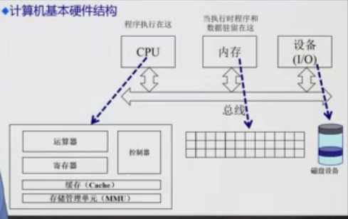
#### 内存层次结构

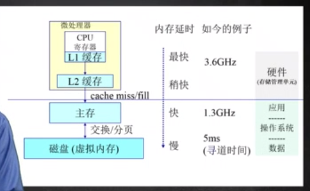
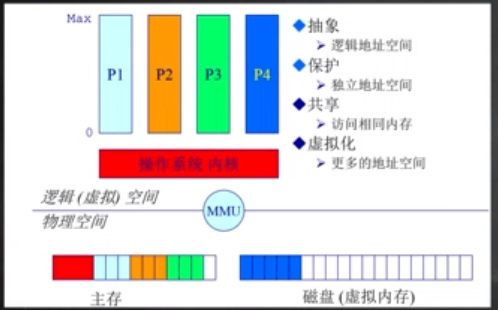

* 逻辑地址空间 -- 程序所看到的空间
* 物理地址空间 -- 主存，硬盘等

#### 操作系统管理内存的常用方法

* 程序重定位
* 分段
* 分页
* 虚存管理
* 按需分页虚拟内存

#### 实现高度依赖于硬件

* 必须知道内存架构
* MMU (内存管理单元): 硬件组件负责处理CPU的内存访问请求

### 地址空间&地址生成

* 地址空间定义
* 地址生成
* 地址安全检查

#### 地址空间
分为逻辑地址空间和物理地址空间

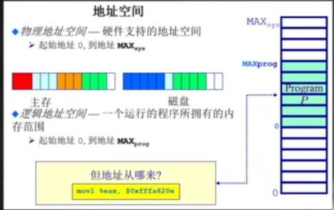

* 如何建立对应关系
    * 逻辑地址生成
    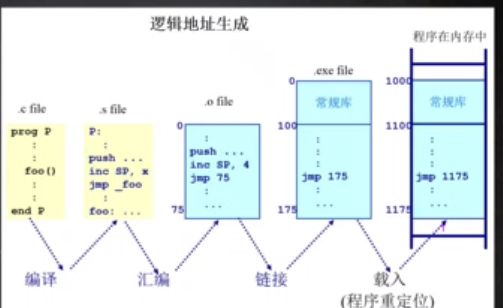

    * 指令的逻辑地址如何对应到物理地址
    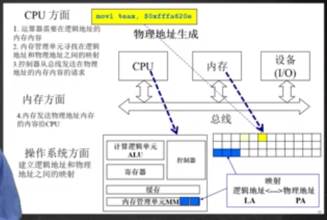
操作系统确保每个程序的可以有效访问的地址空间

### 连续内存分配

#### 内存分配与分区的动态分配
* 内存碎片问题
* 分区的动态分配
    * 第一适配
    * 最佳适配
    * 最差适配
##### 内存碎片问题
空闲的内存不能被利用
* 外部碎片
    - 在分配单元之间未使用的内存
* 内部碎片
    - 在分配单元中未使用的内存
##### 简单的内存管理方法
* 当一个程序被允许在从内存中运行时,分配一个连续的内存
* 分配一个连续的内存给运行的程序访问数据

* 分配策略
    * 首次适配
    * 最优适配
    * 最差适配

* 首次适配
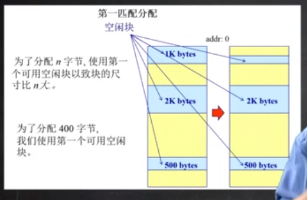
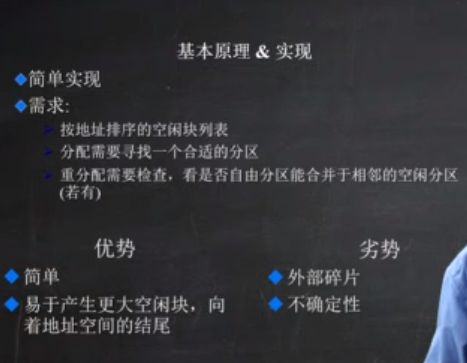
* 最优适配
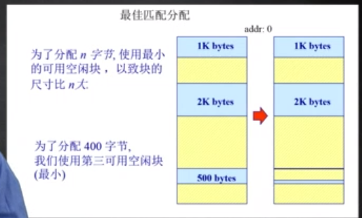
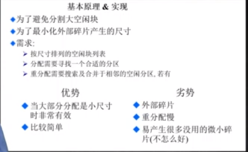
* 最差适配
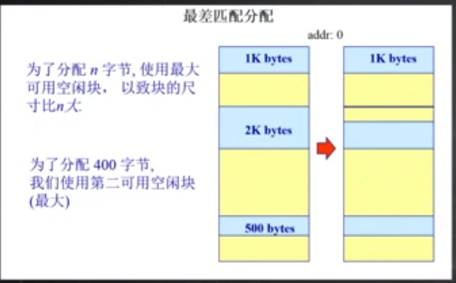
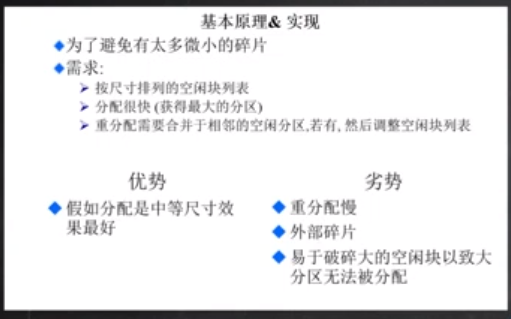

#### 压缩式与交互式碎片整理 
##### 压缩式碎片整理
通过挪动程序，紧凑式的整理内存空间,让下一个程序有空间
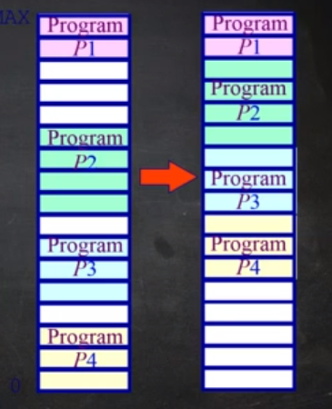

##### 交换式碎片整理
内存不够时，通过与磁盘交互,将磁盘作为临时的内存空间
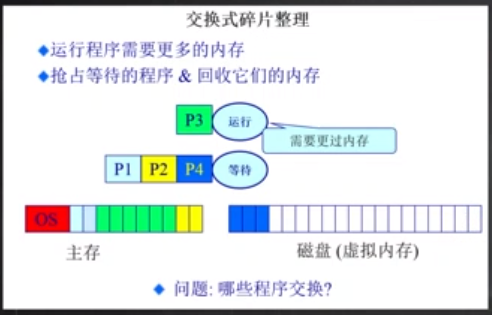

### 小结
* 计算机体系结构/内存分层体系
    * 计算机体系结构
    * 内存分层体系
    * 在操作系统的内存管理范例
* 地址空间 & 地址生成
    * 地址空间定义
    * 地址生成
    * 地址安全检查
* 连续内存分配
    * 内存碎片问题
    * 分区的动态分配(会产生内存碎片)
        * 首次适配
        * 最优适配
        * 最差适配
    * 压缩式碎片整理
    * 交换式碎片整理
